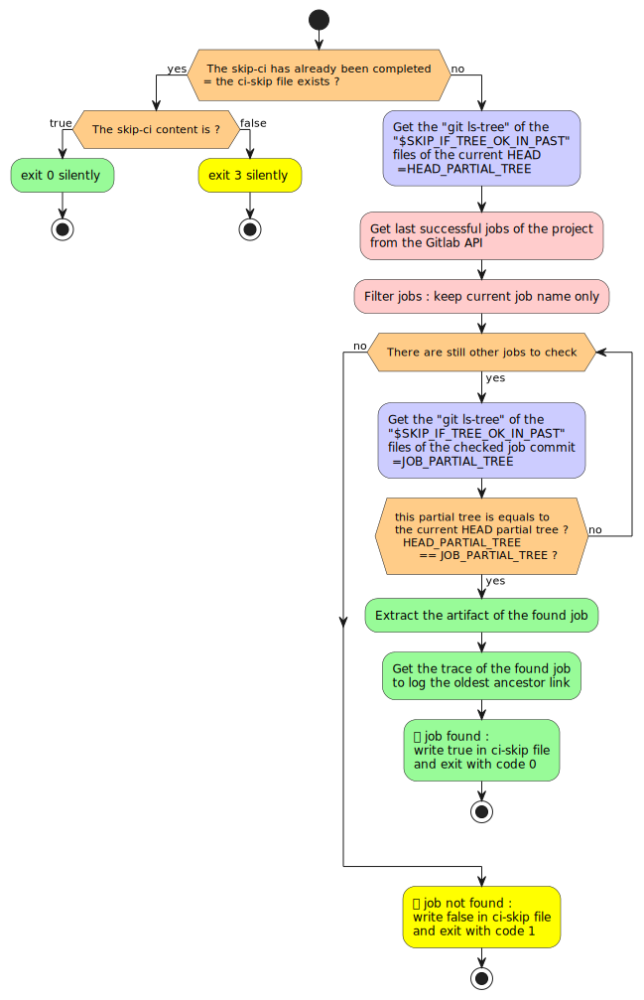

# skip-if-tree-ok-in-past rust-api-version

From :

* https://gitlab.com/jersou/gitlab-skip-if-tree-ok-in-past
* https://github.com/jersou/gitlab-skip-if-tree-ok-in-past

**To skip the running of a job if another job has already succeeded in the past
with the same versions of the files on which the job depends.**

This project is useful on monorepo :
it permits to run the jobs of services that have changed but to skip the jobs of
the services that have already been tested in the past in the current state of
their files.

It is complementary to the Gitlab feature
[rules:changes:compare_to](https://docs.gitlab.com/ee/ci/yaml/index.html#ruleschangescompare_to) :
for long running branch, the files can be different from the compare_to
reference but have been tested since the fork.

Implementation summary :

1. Check if the script has already been completed : check if the ci-skip file
   exists. If file
   exists, exit, else :
2. Get the "git ls-tree" of the tree "$SKIP_IF_TREE_OK_IN_PAST" of the current
   HEAD
3. Get last successful jobs of the project
4. Filter jobs : keep current job only
5. For each job :
    1. Get the "git ls-tree" of the tree "$SKIP_IF_TREE_OK_IN_PAST"
    2. Check if this "git ls-tree" equals the current HEAD "git ls-tree" (see
       2.)
    3. If the "git ls-tree" are equals, write true in ci-skip file and exit with
       code 0
6. If no job found, write false in ci-skip file and exit with code > 0



⚠️ Requirements :

- the variable `SKIP_IF_TREE_OK_IN_PAST` must contain the paths used by the job
- if the nested jobs of current uses the dependencies key with current, the
  dependencies files need to be in an artifact
- CI variables changes are not detected
- need `API_READ_TOKEN` (project access tokens that have read_api scope)
- set `GIT_DEPTH` variable to 1000 or more

```yaml
Usage in .gitlab-ci.yml file:
  SERVICE-A:
    stage: test
    image: alpine
    variables:
      GIT_DEPTH: 1000
      SKIP_IF_TREE_OK_IN_PAST: service-A LIB-1 .gitlab-ci.yml skip-if-tree-ok-in-past
    script:
      - ./skip-if-tree-ok-in-past || service-A/test1.sh
      - ./skip-if-tree-ok-in-past || service-A/test2.sh
      - ./skip-if-tree-ok-in-past || service-A/test3.sh
```

The skip-if-tree-ok-in-past environment variables :

- `SKIP_IF_TREE_OK_IN_PAST`: [required]  must contain the paths used by the job
- `API_READ_TOKEN`: [required] project access tokens that have read_api scope
- `SKIP_CI_COMMIT_TO_CHECK_SAME_JOB_MAX`: [default=100] stop check if this limit
  is reached
- `SKIP_CI_COMMIT_TO_CHECK_SAME_REF_MAX`: [default=3] stop check if this limit
  is reached
- `SKIP_CI_PAGE_TO_FETCH_MAX`: [default=5] max queries to the gitlabAPI /jobs
- `SKIP_CI_VERBOSE`: [default=false] "true" to enable verbose log
